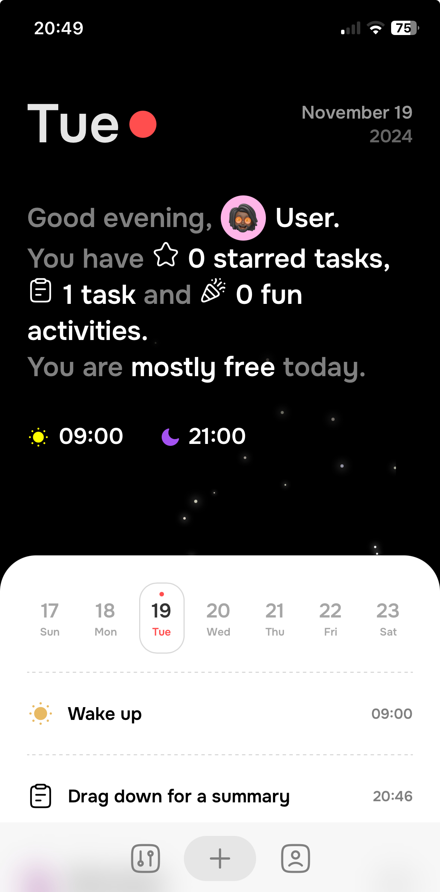

# Espoir Journal

A localStorage task management app intended for mobile use only. You can create a task for each day, you can complete or delete it. There is an onboarding screen and the app provides option for setting a prefered avatar, name as well as wake up and wind down times. The unique feature of the app is the dragabble summary component which provides information for the total tasks by category for the day, along with a short summary sentence.

## Demo

## Screenshots

## The Idea Behind

The goal of this project was to build a functional Vue 3 app inspired by a design post on X. My focus was on crafting a highly creative user experience, enhanced with seamless and engaging interactions.

## Features

- Task Creation, Completion and Deletion
- User and App Settings
- Daily Summary
- State Management using pinia

## Tech Stack

**Client:** Vite, Vue 3, GSAP, GSAP - Draggable, localStorage, pinia

## Roadmap

- Left/Right Swipe for a day change 🔜
- Web and Tablet support 🔜
- Onboarding screen and animation ✅
- Dark mode 🔜
- Code cleaning

## Acknowledgements
Inspired by the X post of Alexey Sekachov:
 
 [do you think a daily summary could be useful, or is it just a waste of space?](https://x.com/sekachov/status/1843683100515242185)