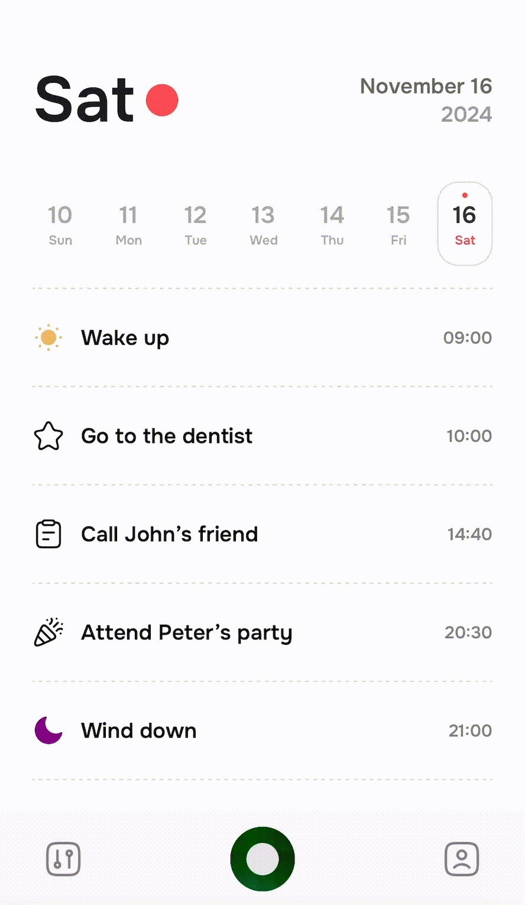
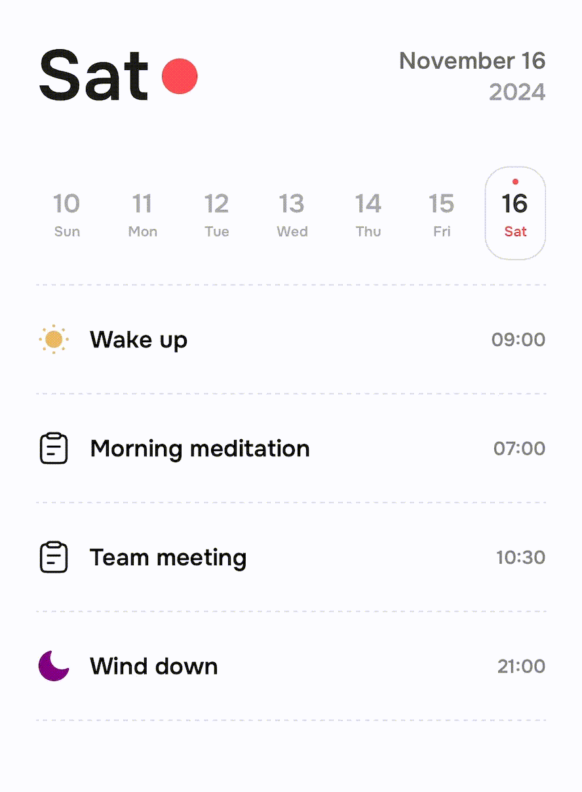
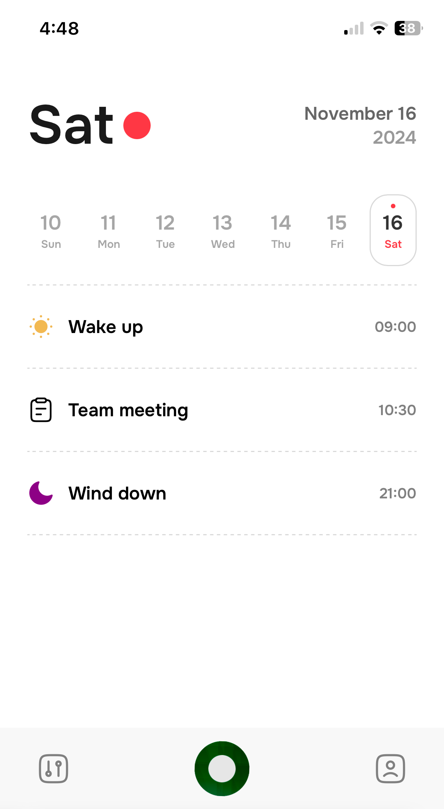
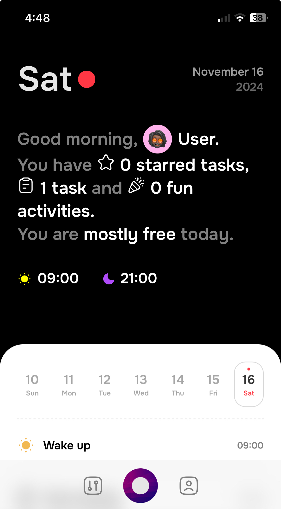
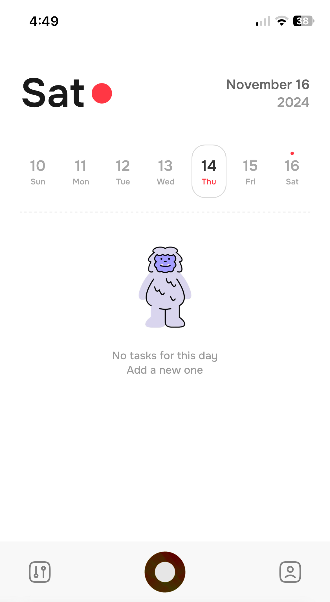
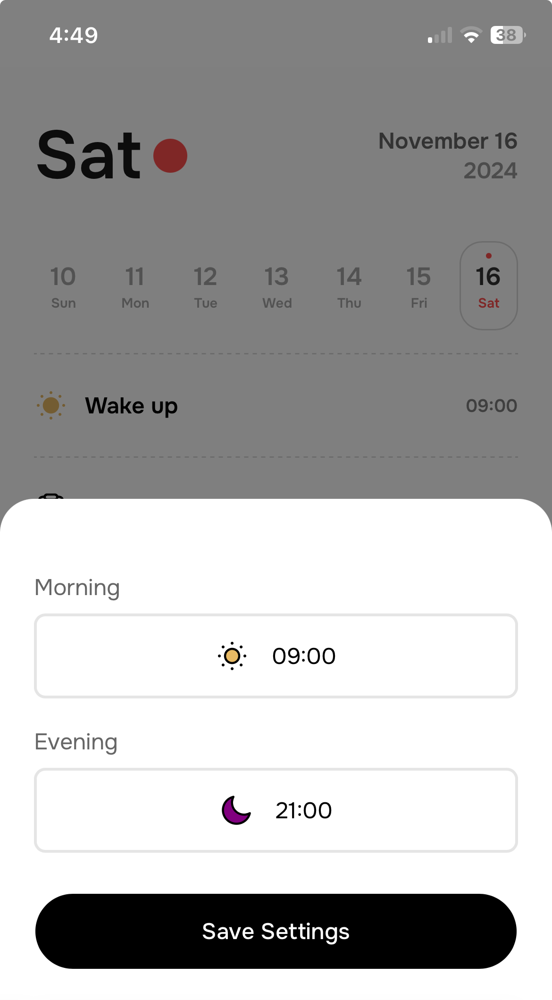
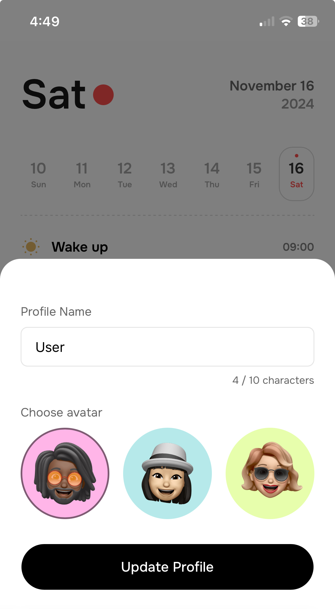

# Espoir Journal

A localStorage task management app intended for mobile use only.

## Demo

## Screenshots

## The Idea Behind

The goal of this project was to build a functional Vue 3 app inspired by a design post on X. My focus was on crafting a highly creative user experience, enhanced with seamless and engaging interactions.

## Features

- Task Creation, Completion and Deletion
- User and App Settings
- Daily Summary
- State Management using pinia

## Tech Stack

**Client:** Vite, Vue 3, GSAP, GSAP - Draggable, localStorage, pinia

## Roadmap

- Web and Tablet support
- Onboarding screen and animation
- Dark mode

## Acknowledgements
Inspired by the X post of Alexey Sekachov:
 
 [do you think a daily summary could be useful, or is it just a waste of space?](https://x.com/sekachov/status/1843683100515242185)